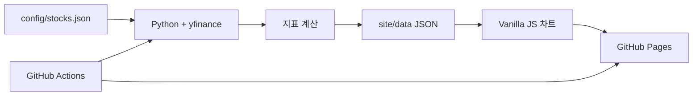

# Market Lens — 미국 주식 일봉 차트

별도 서버와 데이터베이스 없이 미국 주식의 일봉 OHLCV와 기술적 지표를 확인하는 개인용 정적 웹사이트입니다. Python이 데이터를 JSON으로 만들고, 브라우저가 TradingView Lightweight Charts™ 5.2로 인터랙티브 차트를 렌더링합니다. GitHub Actions는 미국 증시 마감 뒤 데이터를 갱신해 GitHub Pages에 자동 배포합니다.

> 이 프로젝트는 개인 학습 및 참고용입니다. 투자 판단을 위한 공식 금융 정보가 아니며 데이터의 정확성·완전성·실시간성을 보장하지 않습니다.

## 주요 기능

- PLTR, NVDA, AAPL, MSFT, TSLA 기본 지원
- 일봉 캔들 및 상승·하락 거래량
- SMA120, SMA200, VWMA100
- Bollinger Basis/Upper/Lower(20일, 표준편차 2배)
- 지표별 최신값을 오른쪽 가격축의 색상 라벨로 표시
- 최신 종가의 수평 점선과 종목 코드 라벨
- 십자선 날짜의 OHLCV·지표값을 상단에서 확인
- `1D · 일봉` 간격을 명확히 표시하고 3개월·6개월·1년·2년·전체 화면 범위 전환
- SMA120, SMA200, VWMA100, BB Upper/Basis/Lower를 각각 표시하거나 숨김
- 지표별 선 색상과 1~4px 굵기 조절(브라우저에 설정 저장)
- 마우스/터치 확대·축소·좌우 이동 및 가격축 상하 이동 도구
- 오른쪽 가격축 드래그로 세로 확대·축소, 더블클릭으로 자동 범위 복원
- `Shift`를 누른 동안 마우스 이동만으로 시작/종료 가격, 등락액, 등락률, 일봉 수 확인
- `Shift`를 떼면 측정 박스 즉시 삭제
- 자동 맞춤으로 수동 조절한 가격축 즉시 복원
- 다크/라이트 테마 및 모바일 반응형 UI
- 종목별 실패 격리, 최대 3회 재시도, 전 종목 실패 시 배포 중단

## 동작 구조



정적 페이지는 API 키나 브라우저의 외부 금융 API 호출 없이, 함께 배포된 JSON만 읽습니다. 예약 실행 때 GitHub Actions가 JSON을 새로 만들므로 별도 웹 서버가 필요하지 않습니다. 데이터 생성은 yfinance를 우선 사용하며, yfinance의 쿠키 경로가 일시적으로 요청 제한을 받는 경우 같은 Yahoo Chart 데이터를 직접 읽는 무키 보조 경로로 전환합니다.

## 기술 스택

- Python 3.12
- yfinance 1.5.2, pandas 2.2.3, numpy 2.3.5
- pytest 9.1.1
- HTML5, CSS3, Vanilla JavaScript
- TradingView Lightweight Charts™ 5.2.0 standalone 빌드
- GitHub Actions, GitHub Pages

## 지표 계산 기준

| 지표 | 계산 방식 |
|---|---|
| SMA120 | 최근 120거래일 종가의 산술평균 |
| SMA200 | 최근 200거래일 종가의 산술평균 |
| VWMA100 | 최근 100거래일의 `Σ(Close × Volume) / ΣVolume` |
| BB Basis | 최근 20거래일 종가의 산술평균 |
| BB Upper | Basis + 모집단 표준편차(`ddof=0`) × 2 |
| BB Lower | Basis - 모집단 표준편차(`ddof=0`) × 2 |

계산 기간이 부족하거나 VWMA100의 100일 거래량 합계가 0이면 값은 JSON의 `null`이 됩니다. `NaN`, `Infinity`, numpy 전용 숫자 타입은 JSON에 기록하지 않습니다.

### 수정주가 정책

`src/fetch_data.py`에서 `yfinance.download(..., auto_adjust=True)`를 명시합니다. 따라서 OHLC는 주식 분할과 배당을 반영한 수정주가 기준이며, 같은 기준을 모든 가격 지표에 일관되게 사용합니다. 거래량은 yfinance가 제공하는 해당 일자의 거래량입니다.

## 프로젝트 구조

```text
stock-chart-dashboard/
├── .github/workflows/deploy-pages.yml
├── config/stocks.json
├── src/
│   ├── config.py
│   ├── fetch_data.py
│   ├── indicators.py
│   ├── json_generator.py
│   └── main.py
├── site/
│   ├── index.html
│   ├── assets/
│   │   ├── app.js
│   │   ├── style.css
│   │   └── vendor/
│   └── data/
├── tests/
├── requirements.txt
└── README.md
```

## 로컬 설치와 실행

프로젝트 루트에서 다음 명령을 실행합니다.

```bash
python -m venv .venv
```

Windows PowerShell:

```powershell
.\.venv\Scripts\Activate.ps1
python -m pip install -r requirements.txt
```

macOS/Linux:

```bash
source .venv/bin/activate
python -m pip install -r requirements.txt
```

테스트와 데이터 생성:

```bash
python -m pytest -q
python -m src.main
```

정적 웹 서버 실행:

```bash
python -m http.server 8000 --directory site
```

브라우저에서 <http://localhost:8000>을 엽니다. `file://`로 `site/index.html`을 직접 열면 브라우저 보안 정책 때문에 JSON `fetch`가 차단될 수 있으므로 반드시 HTTP 서버를 사용하세요.

## 관심 종목 변경

`config/stocks.json`만 수정합니다.

```json
[
  {
    "symbol": "PLTR",
    "name": "Palantir Technologies"
  },
  {
    "symbol": "AMD",
    "name": "Advanced Micro Devices"
  }
]
```

종목 코드는 대문자로 정규화되며 영문자, 숫자, 점(`.`), 하이픈(`-`)을 허용합니다. 설정에서 종목을 추가하거나 삭제한 뒤 `python -m src.main`을 실행하면 `site/data/stocks.json`과 종목별 JSON, 웹사이트 드롭다운에 자동 반영됩니다. Python과 JavaScript에 종목 목록을 중복 작성할 필요가 없습니다.

## GitHub 저장소 생성과 최초 업로드

GitHub Pages를 무료로 공개하려면 새 저장소를 `Public`으로 만드는 것이 가장 단순합니다. 저장소 이름은 `stock-chart-dashboard`를 권장합니다.

1. GitHub에서 **New repository**를 선택합니다.
2. 이름을 `stock-chart-dashboard`, 공개 범위를 **Public**으로 설정합니다.
3. README나 `.gitignore` 자동 생성을 선택하지 않고 빈 저장소를 만듭니다.
4. 이 프로젝트 루트에서 아래 명령을 실행합니다.

```bash
git init -b main
git add .
git commit -m "Build stock chart dashboard"
git remote add origin https://github.com/YOUR-USERNAME/stock-chart-dashboard.git
git push -u origin main
```

이미 GitHub CLI에 로그인했다면 저장소 생성과 push를 한 번에 할 수도 있습니다.

```bash
gh repo create stock-chart-dashboard --public --source=. --remote=origin --push
```

## GitHub Pages 설정

1. 저장소의 **Settings → Pages**로 이동합니다.
2. **Build and deployment → Source**에서 **GitHub Actions**를 선택합니다.
3. **Actions** 탭에서 `Update market data and deploy Pages` 실행이 끝날 때까지 기다립니다.
4. 완료된 `Deploy GitHub Pages` 작업 또는 **Settings → Pages**에서 사이트 주소를 확인합니다.

워크플로가 업로드하는 경로는 `./site`이므로 Pages 아티팩트 최상위에 `index.html`이 위치합니다.

## 자동·수동 실행

워크플로는 다음 조건에서 실행됩니다.

- `main` 브랜치 push
- Actions 탭의 **Run workflow** 수동 실행
- UTC 기준 월~금 23:17 (`17 23 * * 1-5`)

한국 시간으로는 화~토 오전 8:17이며, 미국 정규장 마감 이후입니다. GitHub 예약 작업은 혼잡도에 따라 다소 늦게 시작할 수 있습니다. 주말이나 미국 휴장일에는 yfinance가 제공하는 마지막 거래일까지 유지됩니다.

## 차트 사용법

- 종목: 상단 드롭다운에서 선택
- 봉 간격: 화면의 `1D · 일봉` 배지로 확인
- 확대/축소: 마우스 휠 또는 모바일 핀치
- 좌우 이동: 기본 상태에서 차트를 드래그
- 상하 이동: `가격 이동`을 누른 뒤 차트를 위아래로 드래그
- 세로 확대/축소: 오른쪽 가격축 숫자 영역을 위아래로 드래그
- 가격축 더블클릭: 자동 범위 복원
- 가격축 복원: `자동 맞춤` 클릭
- 등락률 측정: 차트 위에서 `Shift`를 누른 채 마우스를 움직임(클릭 불필요)
- 측정 삭제: `Shift`를 떼는 즉시 자동 삭제
- 특정 날짜: 십자선을 캔들 위로 이동
- 화면 범위: `3개월`, `6개월`, `1년`, `2년`, `전체`
- 지표 표시: `지표 설정`의 체크박스 또는 차트 왼쪽 위 개별 범례 클릭
- 지표 스타일: `지표 설정`에서 각 선의 색상과 굵기 선택
- 테마: 오른쪽 위 해/달 버튼

십자선을 이동해도 오른쪽 가격축 라벨은 항상 각 시리즈의 **최신값**을 유지합니다.

## 데이터 수집 오류 해결

1. 네트워크가 Yahoo Finance에 접근 가능한지 확인합니다.
2. `python -m src.main` 로그에서 실패한 종목과 마지막 예외를 확인합니다.
3. `config/stocks.json`의 종목 코드가 Yahoo Finance 형식과 일치하는지 확인합니다.
4. 일시적인 요청 제한이면 잠시 뒤 GitHub Actions의 **Run workflow**를 다시 실행합니다.
5. 의존성 문제면 새 가상환경에서 `python -m pip install -r requirements.txt`를 다시 실행합니다.

각 종목은 최대 3회 재시도합니다. 일부 종목만 실패하면 성공 종목은 계속 생성하고, 기존 종목 JSON이 있으면 그 파일을 보존한 채 `updateStatus: "error"`로 표시합니다. 모든 종목이 실패하면 프로그램이 종료 코드 1로 끝나 Pages 배포가 진행되지 않습니다.

## 데이터 및 라이선스 주의사항

- yfinance는 Yahoo Finance의 비공식 오픈소스 클라이언트입니다. 제공 데이터의 이용 조건을 확인하고 개인 연구·학습 범위에서 사용하세요.
- 시세는 지연되거나 정정될 수 있으며 거래소의 공식 데이터가 아닙니다.
- Lightweight Charts™는 TradingView가 개발한 Apache 2.0 오픈소스 라이브러리입니다.
- 이 프로젝트는 TradingView의 공식 서비스나 제휴 제품이 아닙니다.
- 차트의 TradingView attribution logo와 하단 출처 링크를 유지하세요.
- vendored 라이브러리의 `LICENSE`와 `NOTICE`는 `site/assets/vendor/`에 함께 포함됩니다.
